# ASA: Servidor DHCP com dnsmasq

```mermaid
graph LR

    %% Declaração dos nós
    iface["1. Interface(s)<br>com IP fixo"]
    doc["2. Ler alguma<br>documentação"]
    pct["3. Instalar<br>pacote"]
    conf["4. Configuração"]
    teste["5. Testar arquivo<br>de configuração"]
    recarregar["6. Recarregar<br>serviço"]
    cliente["7. Testar um cliente<br>na mesma rede"]
    liberacoes["8. Consultar as<br>concessões"]
    log["9. Analisar<br>log"]

    %% Interligação entre os nós
    iface --> doc --> pct --> conf --> teste
    teste --> recarregar --> cliente --> liberacoes
    liberacoes --> log

    %% Inserção de links nos nós
    click iface "interfaces/"
    click doc "documentacao/"
    click pct "pacote/"
    click conf "edicao/"
    click teste "teste/"
    click recarregar "recarga/"
    click cliente "clientes/"
    click liberacoes "concessoes/"
    click log "log/"


```

Vamos:

- [Configurar as interfaces de rede](interfaces.md)
- [Instalar o pacote](pacote.md)
- [Ler a documentação do Debian](documentacao.md)
- [Remover todo o conteúdo do arquivo de configuração](limpeza.md)
- [Criar novo arquivo de configuração, à nossa maneira](edicao.md)
- [Testar arquivo de configuração](teste.md)
- [Fazer o serviço recarregar o arquivo de configuração](recarga.md)
- [Reiniciar o serviço](reinicio.md)
- [Verificar o estado do serviço](estado.md)
- [Habilitar o serviço para inicialização automatica](habilitacao.md)
- [Ligar um cliente na mesma rede](clientes.md)
- [Analisar os logs](log.md)
- [Revisar o que foi visto](revisao.md)
