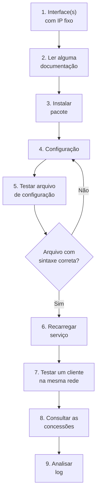

# Revisão

```mermaid
graph TD

    %% Declaração dos nós
    iface["1. Interface(s)<br>com IP fixo"]
    doc["2. Ler alguma<br>documentação"]
    pct["3. Instalar<br>pacote"]
    conf["4. Configuração"]
    teste["5. Testar arquivo<br>de configuração"]
    recarregar["6. Recarregar<br>serviço"]
    cliente["7. Testar um cliente<br>na mesma rede"]
    liberacoes["8. Consultar as<br>concessões"]
    log["9. Analisar<br>log"]

    %% Interligação entre os nós
    iface --> doc --> pct --> conf --> teste
    teste --> correto{"Arquivo com<br>sintaxe correta?"}
    correto --> |Não| conf
    correto --> |Sim| recarregar --> cliente
    cliente --> liberacoes --> log

    %% Inserção de links nos nós
    click iface "../interfaces/"
    click doc "../documentacao/"
    click pct "../pacote/"
    click conf "../edicao/"
    click teste "../teste/"
    click recarregar "../recarga/"
    click cliente "../clientes/"
    click liberacoes "../liberacoes/"
    click log "../log/"


```